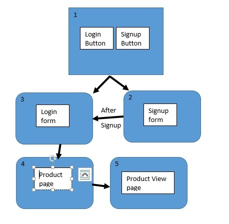

# 🛒 Simple HTML-Only E-commerce/Product Showcase Project

This project is a simple, multi-page website built entirely with **HTML**. It demonstrates basic webpage linking, form handling, product listing, and the use of tables for structured data display.

## 📄 Project Files

The project consists of the following HTML files:

| File Name | Description | Purpose |
| :--- | :--- | :--- |
| `Home.html` | **Homepage** | The landing page with links to Login and Signup. |
| `signup.html` | **Signup Form** | Allows a user to create an account and links to `login.html` upon submission. |
| `login.html` | **Login Form** | Allows a user to log in and links to `product_page.html` upon submission. |
| `product_page.html` | **Product List** | Displays a high-level list of product categories (Food and Clothing) and links to the detailed product view. |
| `product_view_page.html` | **Product Details** | Provides a detailed view of products using HTML tables, including image previews and a map iframe. |

---

## 🚀 How to Run the Project

Since this is an HTML-only project, no server or complex setup is required.

1.  **Download/Clone:** Download all the files (`.html` files and the image) into a single folder.
2.  **Open:** Open the `Home.html` file directly in any web browser (e.g., Chrome, Firefox, Edge).
3.  **Navigate:** Use the navigation buttons and links to browse the different pages.

---

## 🗺️ Website Flow

The project follows a linear user flow for navigation between pages:

1.  **Home** (`Home.html`)
    * **Login** $\rightarrow$ `login.html`
    * **Signup** $\rightarrow$ `signup.html`
2.  **Login** $\rightarrow$ **Product Page** (`product_page.html`)
3.  **Signup** $\rightarrow$ **Login** (`login.html`)
4.  **Product Page** $\rightarrow$ **Product View Page** (`product_view_page.html`)
5.  **Product View Page** $\rightarrow$ **Product Page** (`product_page.html`)

---

## 🖼️ Project Preview

Below is a preview image of one of the pages in the project.

## 📝 Key Features

* **Basic Navigation:** Links between all five pages.
* **Form Handling:** Includes a **Login** form and a **Signup** form (with forms simply directing to the next page, as no backend is implemented).
* **Product Catalog:** Displays Food and Clothing items.
* **Structured Data:** Uses an HTML `<table>` for detailed product listings, including images.
* **Geo Location:** Includes an `<iframe>` for map embedding on the product details page.